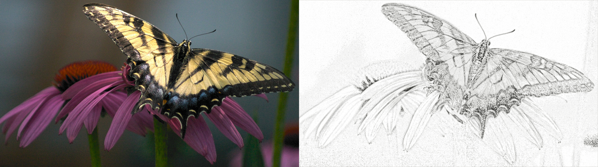
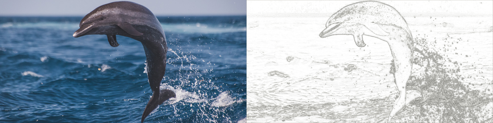
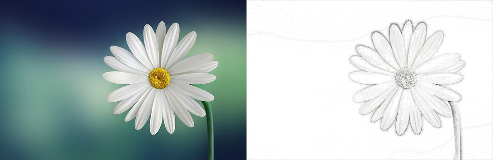
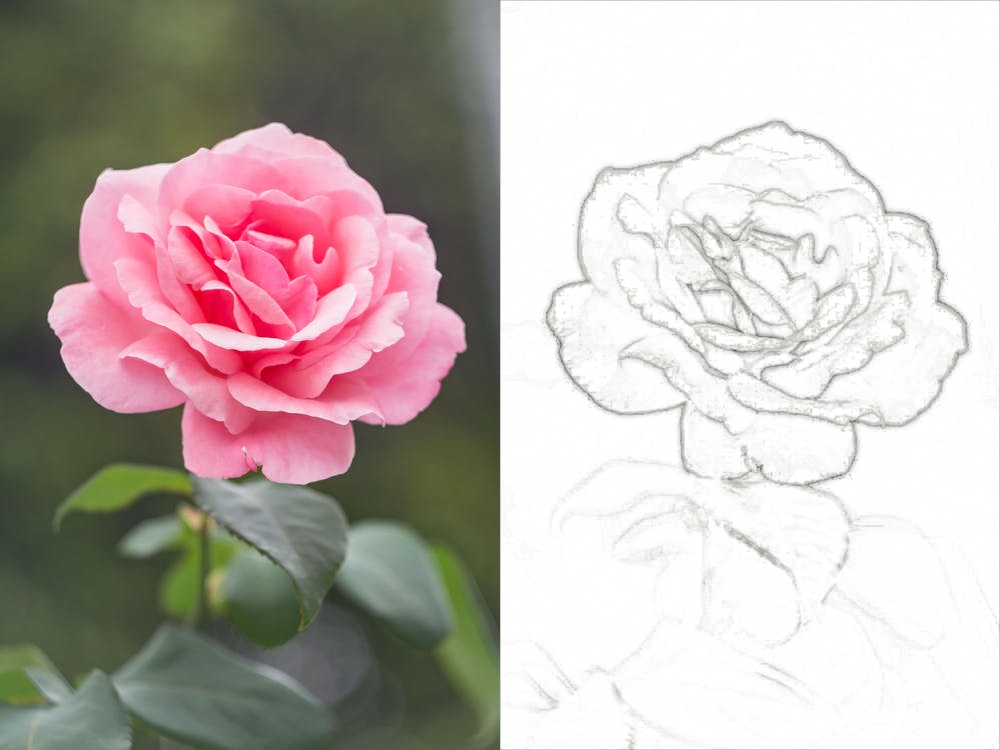

# Image 2 Sketch

## Overview
This project introduces a novel method for feature extraction from images and utilizes this method to create a sketch composite for a given image. The method, called the Orthogonal Gaussian Lattice Method, involves using three Gaussian functions to compute the inverse of the grayscale of the image. These inverses are then used to create three simple graphs, from which lattices are extracted and utilized as features for image sketching.

- [Report](assets/image-2-sketch-report.pdf)
- [Explanation Notebook with Code](notebook/novel-method-explanation.ipynb)
- [Results](#a-few-results)

## Introduction
Various methods exist for extracting edges from images, as well as for object detection and region segmentation. This project proposes a new method for feature extraction and utilizes it to create sketch composites from images.

## Current Method
The current state-of-the-art method for image sketching is the Gaussian Blur-Blend Method. This method involves converting the image to grayscale, applying a Gaussian blur, and then dividing the grayscale image by the blurred image to create a sketch-like effect.

## Novel Method
The proposed Orthogonal Gaussian Lattice Method utilizes three Gaussian functions to compute the inverse grayscale of the image. These inverses are used to create three simple graphs, from which lattices are extracted. These lattices are then used as features for image sketching.

For full details, refer to the [Jupyter Notebook with Complete Explanation](notebook/novel-method-explanation.ipynb).

## A Few Results


 





## Running it On Your Machine
To run this program on your machine, follow these steps:

1. Clone the repository and navigate to the project directory:
   ```shell
   git clone https://github.com/AmitRanjan235/Image-To-Sketch.git
   cd image2sketch
